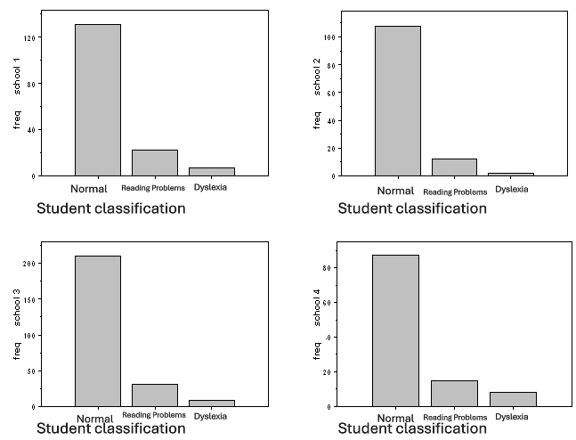

```{r, echo = FALSE, results = "hide"}
include_supplement("uva-ordinal-293-en-graph01.PNG", recursive = TRUE)
```

Question
========

In four schools, students in grades 3, 4 and 5 are assigned to one of 3 classes in terms of their reading abilities: normal, reading difficulties, dyslexia. The numbers of students in each class are shown in the following 4 bar graphs. The variable \"student classification" is measured on



Answerlist
----------

* Nominal measurement level
* Ordinal measurement level
* Interval level
* Ratio measurement level

Solution
========

Answerlist
----------

* Nominal measurement level: Incorrect
* Ordinal measurement level: Correct
* Interval measurement level: Incorrect
* Ratio measurement level: Incorrect

Meta-information
================
exname: uva-ordinal-293-en
extype: schoice
exsolution: 0100
exsection: Measurement Level/Ordinal
exextra[Type]: Conceptual
exextra[Language]: English
exextra[Level]: Statistical Literacy
exextra[IRT-Difficulty]: 2.238
exextra[p-value]: 0.4987
