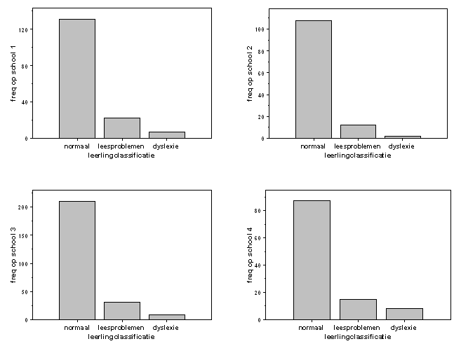

```{r, echo = FALSE, results = "hide"}
include_supplement("uva-ordinal-293-nl-graph01.png", recursive = TRUE)
```

Question
========

Op vier scholen worden de leerlingen in groepen 3, 4 en 5 in één van 3
klassen ingedeeld voor wat betreft hun leesvaardigheid: normaal,
leesproblemen, dyslexie. De aantallen leerlingen in iedere klasse staan
in de volgende 4 staafdiagrammen weergegeven. De variabele
\"leerlingclassificatie\" wordt gemeten op



Answerlist
----------

* nominaal meetniveau
* ordinaal meetniveau
* interval meetniveau
* ratio meetniveau

Solution
========

Answerlist
----------

* nominaal meetniveau: Incorrect
* ordinaal meetniveau: Correct
* interval meetniveau: Incorrect
* ratio meetniveau: Incorrect

Meta-information
================
exname: uva-ordinal-293-nl
extype: schoice
exsolution: 0100
exsection: Measurement Level/Ordinal
exextra[Type]: Conceptual
exextra[Language]: Dutch
exextra[Level]: Statistical Literacy
exextra[IRT-Difficulty]: 2.238
exextra[p-value]: 0.4987
