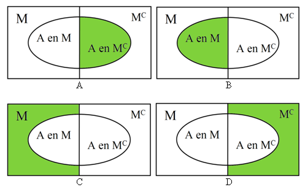

```{r, echo = FALSE, results = "hide"}
include_supplement("uva-conditional-probability-698-nl-graph01.png", recursive = TRUE)
```

Question
========

22% of breadwinners earn at least €40,000 per year. Of these breadwinners 70% own a car. Of the other breadwinners, 47% own a car. If you choose a random breadwinner what is the probability that this one owns a car?



Answerlist
----------

* 0,22
* 0,47
* 0,52
* 0,70

Solution
========

Answerlist
----------

* 0.22: Incorrect
* 0.47: Incorrect
* 0.52: Correct
* 0.70: Incorrect

Meta-information
================
exname: uva-conditional-probability-698-en
extype: schoice
exsolution: 0010
exsection: Probability/Elementary Probability/Conditional probability
exextra[Type]: Conceptual
exextra[Language]: English
exextra[Level]: Statistical Literacy
exextra[IRT-Difficulty]: 2.163
exextra[p-value]: 0.5085
