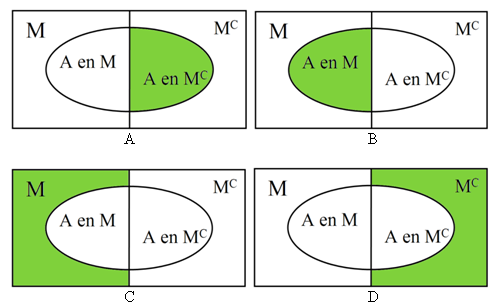

```{r, echo = FALSE, results = "hide"}
include_supplement("uva-conditional-probability-698-nl-graph01.png", recursive = TRUE)
```

Question
========

22% van de kostwinners verdient tenminste € 40.000 per jaar. Van deze
kostwinners bezit 70% een auto. Van de andere kostwinners bezit 47% een
auto. Als je een willekeurige kostwinner kiest wat is dan de kans dat
deze een auto bezit?



Answerlist
----------

* 0,22
* 0,47
* 0,52
* 0,70

Solution
========

Answerlist
----------

* 0,22: Incorrect
* 0,47: Incorrect
* 0,52: Correct
* 0,70: Incorrect

Meta-information
================
exname: uva-conditional-probability-698-nl
extype: schoice
exsolution: 0010
exsection: Probability/Elementary Probability/Conditional probability
exextra[Type]: Conceptual
exextra[Language]: Dutch
exextra[Level]: Statistical Literacy
exextra[IRT-Difficulty]: 2.163
exextra[p-value]: 0.5085
