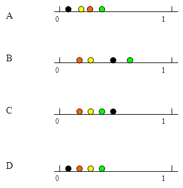

```{r, echo = FALSE, results = "hide"}
include_supplement("uva-elementary-probability-748-en-graph01.png", recursive = TRUE)
```

Question
========

A box contains one black ball, two red balls, three yellow balls and four green balls. Suppose you randomly take a ball from the box, which of the drawings below represents the correct order in terms of odds for the four different colors?



Answerlist
----------

* A
* B
* C
* D

Solution
========

Answerlist
----------

* A: Incorrect
* B: Incorrect
* C: Incorrect
* D: Correct

Meta-information
================
exname: uva-elementary-probability-748-en
extype: schoice
exsolution: 0001
exsection: Probability/Elementary Probability
exextra[ID]: 0cd14
exextra[Type]: Conceptual
exextra[Language]: English
exextra[Level]: Statistical Literacy
exextra[IRT-Difficulty]: 2
exextra[p-value]: 0.5905
