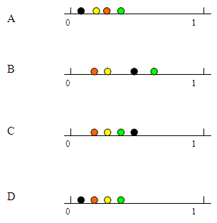

```{r, echo = FALSE, results = "hide"}
include_supplement("uva-elementary-probability-748-nl-graph01.png", recursive = TRUE)
```

Question
========

In een doos zitten één zwarte bal, twee rode ballen, drie gele ballen en
vier groene ballen. Stel je pakt willekeurig een bal uit de doos, welke
van de onderstaande tekeningen geeft de correcte volgorde weer qua
kansen voor de vier verschillende kleuren?



Answerlist
----------

* A
* B
* C
* D

Solution
========

Answerlist
----------

* A: Incorrect
* B: Incorrect
* C: Incorrect
* D: Correct

Meta-information
================
exname: uva-elementary-probability-748-nl
extype: schoice
exsolution: 0001
exsection: Probability/Elementary Probability
exextra[ID]: 243b7
exextra[Type]: Conceptual
exextra[Language]: Dutch
exextra[Level]: Statistical Literacy
exextra[IRT-Difficulty]: 2
exextra[p-value]: 0.5905
