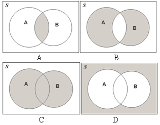

```{r, echo = FALSE, results = "hide"}
include_supplement("uva-events-662-en-graph01.png", recursive = TRUE)
```

Question
========

Suppose *A* is the set of households in which at least one member has completed university. *B* is the set of households where the annual income exceeds €100,000. Which shaded area in the Venn diagram below shows the union of *A* and B?



Answerlist
----------

* A
* B
* C
* D

Solution
========

Answerlist
----------

* A: Incorrect
* B: Incorrect
* C: Correct
* D: Incorrect

Meta-information
================
exname: uva-events-662-en
extype: schoice
exsolution: 0010
exsection: Probability/Elementary Probability/Events
exextra[Type]: Conceptual
exextra[Language]: English
exextra[Level]: Statistical Literacy
exextra[IRT-Difficulty]: 2.791
exextra[p-value]: 0.4286
