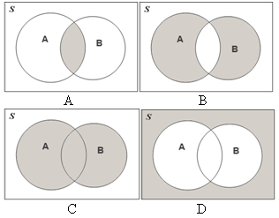

```{r, echo = FALSE, results = "hide"}
include_supplement("uva-events-662-nl-graph01.png", recursive = TRUE)
```

Question
========

Stel *A* is de verzameling van huishoudens waarvan tenminste een lid de
universiteit heeft doorlopen. *B* is de verzameling van huishoudens waar
het jaarinkomen hoger is dan €100.000. Welke gearceerde oppervlakte in
onderstaand Venn-diagram toont de vereniging van *A* en B?



Answerlist
----------

* A
* B
* C
* D

Solution
========

Answerlist
----------

* A: Incorrect
* B: Incorrect
* C: Correct
* D: Incorrect

Meta-information
================
exname: uva-events-662-nl
extype: schoice
exsolution: 0010
exsection: Probability/Elementary Probability/Events
exextra[Type]: Conceptual
exextra[Language]: Dutch
exextra[Level]: Statistical Literacy
exextra[IRT-Difficulty]: 2.791
exextra[p-value]: 0.4286
