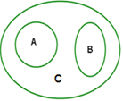

```{r, echo = FALSE, results = "hide"}
include_supplement("uva-events-674-en-graph01.png", recursive = TRUE)
```

Question
========

On the right you see a Venn diagram representing the relationship between two events, namely *A* and *B*. Which situation below fits best to this?



Answerlist
----------

* A is red tea, B is green tea, C is all teas.
* A is freshwater fish, B is fishes, C is the family of fishes.
* A is {1,2,3,5}, B is {2,3,6,7}, C is{1,2,3,5,6,7}.
* A is women, B is men, C is elderly.

Solution
========

Answerlist
----------

* A is red tea, B is green tea, C is all teas...: Correct
* A is freshwater fish, B is fishes, C is the family of fish...: Incorrect
* A is {1,2,3,5}, B is {2,3,6,7}, C is{1,2,3,5,6,7}...: Incorrect
* A is women, B is men, C is elderly: Incorrect: Incorrect

Meta-information
================
exname: uva-events-674-en
extype: schoice
exsolution: 1000
exsection: Probability/Elementary Probability/Events
exextra[ID]: 2e4f5
exextra[Type]: Conceptual
exextra[Language]: English
exextra[Level]: Statistical Literacy
exextra[IRT-Difficulty]: -3.452
exextra[p-value]: 0.9819
