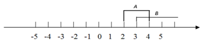

```{r, echo = FALSE, results = "hide"}
include_supplement("uva-events-676-nl-graph01.png", recursive = TRUE)
```

Question
========

Gebeurtenis A = { 2 ≤ x ≤ 4}, en B = {x\|x ≥ 3}.Kijk naar de
onderstaande grafiek, Wat is dan de doorsnede van *A* en *B*?



Answerlist
----------

{x|x ≤ 2}
{x|2 ≤ x ≤ 4}
{x|3 ≤ x ≤ 4}
{x|x ≥ 2}
{x|x > 4}

Solution
========

Answerlist
----------

{x|x ≤ 2}: Incorrect
{x|2 ≤ x ≤ 4}: Incorrect
{x|3 ≤ x ≤ 4}: Correct
{x|x ≥ 2}: Incorrect
{x|x > 4}: Incorrect

Meta-information
================
exname: uva-events-676-nl
extype: schoice
exsolution: 00100
exsection: Probability/Elementary Probability/Events
exextra[Type]: Conceptual
exextra[Language]: Dutch
exextra[Level]: Statistical Literacy
exextra[IRT-Difficulty]: -2.314
exextra[p-value]: 0.9654
