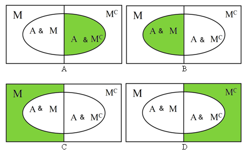

```{r, echo = FALSE, results = "hide"}
include_supplement("uva-events-697-en-graph01.PNG", recursive = TRUE)
```

Question
========

22% of breadwinners earn at least €40,000 per year. Of these breadwinners 70% own a car. Of the other breadwinners, 47% own a car. Suppose the event *A* = "Owns car" and the event *M* = "Earns more than €40,000 per year". Which green part of the Venn diagrams below shows "the other breadwinners of which 47% own a car"?



Answerlist
----------

* A
* B
* C
* D

Solution
========

Answerlist
----------

* A: Correct
* B: Incorrect
* C: Incorrect
* D: Incorrect

Meta-information
================
exname: uva-events-697-en
extype: schoice
exsolution: 1000
exsection: Probability/Elementary Probability/Events
exextra[Type]: Conceptual
exextra[Language]: English
exextra[Level]: Statistical Literacy
exextra[IRT-Difficulty]: 1.407
exextra[p-value]: 0.868
