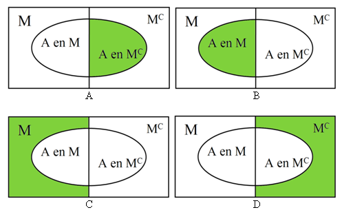

```{r, echo = FALSE, results = "hide"}
include_supplement("uva-events-697-nl-graph01.png", recursive = TRUE)
```

Question
========

22% van de kostwinners verdient ten minste € 40.000 per jaar. Van deze
kostwinners bezit 70% een auto. Van de andere kostwinners bezit 47% een
auto. Stel de gebeurtenis *A* = "Bezit auto" en de gebeurtenis *M* =
"Verdient meer dan € 40.000 per jaar". Welk groen deel van de
onderstaande Venn-diagrammen toont "de andere kostwinners waarvan 47%
een auto bezit"?



Answerlist
----------

* A
* B
* C
* D

Solution
========

Answerlist
----------

* A: Correct
* B: Incorrect
* C: Incorrect
* D: Incorrect

Meta-information
================
exname: uva-events-697-nl
extype: schoice
exsolution: 1000
exsection: Probability/Elementary Probability/Events
exextra[ID]: 77c7c
exextra[Type]: Conceptual
exextra[Language]: Dutch
exextra[Level]: Statistical Literacy
exextra[IRT-Difficulty]: 1.407
exextra[p-value]: 0.868
