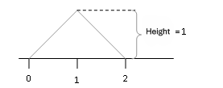

```{r, echo = FALSE, results = "hide"}
include_supplement("uva-random-variables-1317-en-graph01.PNG", recursive = TRUE)
```

Question
========

Suppose the continuous stochastic variable *X* is: any value between 0 and 2. The density curve of *X* is shown below._____________________. Is the area under this curve equal to 1?



Answerlist
----------

* Yes
* No

Solution
========

Answerlist
----------

* Yes: Correct
* No: Incorrect

Meta-information
================
exname: uva-random-variables-1317-en
extype: schoice
exsolution: 10
exsection: Probability/Elementary Probability/Random variables
exextra[ID]: 65ab3
exextra[Type]: Conceptual
exextra[Language]: English
exextra[Level]: Statistical Literacy
exextra[IRT-Difficulty]: -0.863
exextra[p-value]: 0.9464
