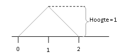

```{r, echo = FALSE, results = "hide"}
include_supplement("uva-random-variables-1317-nl-graph01.png", recursive = TRUE)
```

Question
========

Stel de continue stochastische variabele *X* is: elke waarde tussen 0 en
2. De dichtheidskromme van *X* is hieronder weergegeven.\
Is het oppervlak onder deze kromme gelijk aan 1?



Answerlist
----------

* Ja
* Nee

Solution
========

Answerlist
----------

* Ja: Correct
* Nee: Incorrect

Meta-information
================
exname: uva-random-variables-1317-nl
extype: schoice
exsolution: 10
exsection: Probability/Elementary Probability/Random variables
exextra[ID]: a374f
exextra[Type]: Conceptual
exextra[Language]: Dutch
exextra[Level]: Statistical Literacy
exextra[IRT-Difficulty]: -0.863
exextra[p-value]: 0.9464
