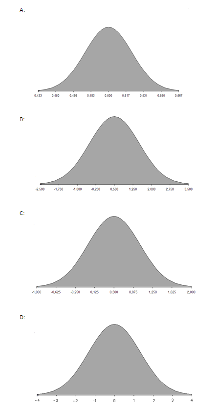

```{r, echo = FALSE, results = "hide"}
include_supplement("uva-variance-1274-en-graph01.png", recursive = TRUE)
```

Question
========

Researchers have a taste test to determine whether people can taste whether Cola contains caffeine. We assume that people cannot judge whether caffeine is present. 500 people are randomly chosen as a sample. The answer is coded as X =1 if they say yes, and as X = 0 if they say no. What then is the sample distribution?



Answerlist
----------

* A
* B
* C
* D

Solution
========

Answerlist
----------

* A: Correct
* B: Incorrect
* C: Incorrect
* D: Incorrect

Meta-information
================
exname: uva-variance-1274-en
extype: schoice
exsolution: 1000
exsection: Probability/Elementary Probability/Random variables/Variance
exextra[Type]: Conceptual
exextra[Language]: English
exextra[Level]: Statistical Literacy
exextra[IRT-Difficulty]: 2
exextra[p-value]: 0.5905
