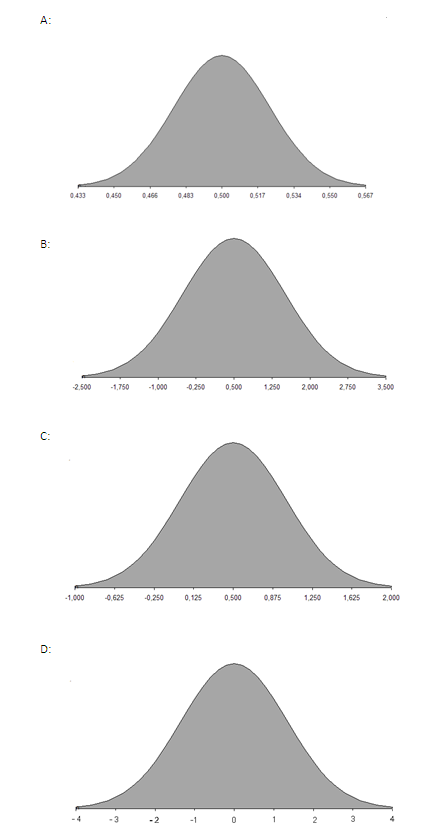

```{r, echo = FALSE, results = "hide"}
include_supplement("uva-variance-1275-en-graph01.png", recursive = TRUE)
```

Question
========

The chance that your stolen car will ever be recovered is 50% in the Netherlands. 500 people whose car is stolen are randomly chosen as a random sample. Each interviewee's answer is coded as X =1 if they say yes, and as X = 0 if they say no. What then is the sample distribution?



Answerlist
----------

* A
* B
* C
* D

Solution
========

Answerlist
----------

* A: Correct
* B: Incorrect
* C: Incorrect
* D: Incorrect

Meta-information
================
exname: uva-variance-1275-en
extype: schoice
exsolution: 1000
exsection: Probability/Elementary Probability/Random variables/Variance
exextra[ID]: a37b5
exextra[Type]: Conceptual
exextra[Language]: English
exextra[Level]: Statistical Literacy
exextra[IRT-Difficulty]: 2
exextra[p-value]: 0.5905
