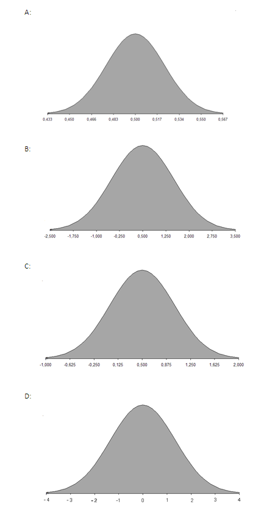

```{r, echo = FALSE, results = "hide"}
include_supplement("uva-variance-1275-nl-graph01.png", recursive = TRUE)
```

Question
========

De kans dat je gestolen auto ooit wordt teruggevonden is 50% in
Nederland. 500 mensen waarvan de auto is gestolen zijn aselect gekozen
als een steekproef. Het antwoord van iedere ondervraagde wordt gecodeerd
als X =1 als ze ja zeggen, en als X = 0 als ze nee zeggen. Wat is dan de
steekproefverdeling?



Answerlist
----------

A
B
C
D

Solution
========

Answerlist
----------

A: Correct
B: Incorrect
C: Incorrect
D: Incorrect

Meta-information
================
exname: uva-variance-1275-nl
extype: schoice
exsolution: 1000
exsection: Probability/Elementary Probability/Random variables/Variance
exextra[Type]: Conceptual
exextra[Language]: Dutch
exextra[Level]: Statistical Literacy
exextra[IRT-Difficulty]: 2
exextra[p-value]: 0.5905
