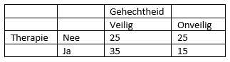

```{r, echo = FALSE, results = "hide"}
include_supplement("vufgb-elementaryprobability-001-nl-table01.jpg", recursive = TRUE)
```

Question
========

Gegeven is onderstaand kruistabel. Bereken de kans op een veilige gehechtheid gegeven dat iemand therapie heeft.


  
Answerlist
----------
* 0.35
* 0.70
* 0.58
* 0.54


Solution
========

Answerlist
----------
* Incorrect
* Correct
* Incorrect
* Incorrect

Meta-information
================
exname: vufgb-elementaryprobability-001-nl
extype: schoice
exsolution: 0100
exsection: Probability/Elementary Probability
exextra[Type]: Calculation
exextra[Program]: 
exextra[Language]: Dutch
exextra[Level]: Statistical Literacy