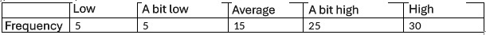

```{r, echo = FALSE, results = "hide"}
include_supplement("vufgb-elementaryprobability-003-en-table01.JPG", recursive = TRUE)
```

Question
========

Given is an absolute frequency table for the ordinal variable Social Competence ($N = 80\;kinderen$).

Calculate the cumulative probability of an outcome Average or lower.


  
Answerlist
----------
* 0.10
* 0.25
* 0.31
* 0.13

Solution
========

Answerlist
----------
* Incorrect
* Incorrect
* Correct
* Incorrect

Meta-information
================
exname: vufgb-elementaryprobability-003-en
extype: schoice
exsolution: 0010
exsection: Probability/Elementary Probability, Descriptive statistics/Data representation/Tables/Frequency table
exextra[ID]: 14bd0
exextra[Type]: Calculation, Interpreting output
exextra[Program]: 
exextra[Language]: English
exextra[Level]: Statistical Literacy
