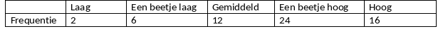

```{r, echo = FALSE, results = "hide"}
include_supplement("vufgb-events-001-nl-table01.jpg", recursive = TRUE)
```

Question
========

Given is an absolute frequency table for the ordinal variable Motor Competence ($N = 60\;kinderen$).

Calculate the cumulative probability of an outcome Somewhat high or lower.


  
Answerlist
----------
* 0.24
* 0.40
* 0.44
* 0.73

Solution
========

Answerlist
----------
* Incorrect
* Incorrect
* Incorrect
* Correct

Meta-information
================
exname: vufgb-events-001-en
extype: schoice
exsolution: 0001
exsection: Probability/Elementary Probability/Events, Descriptive statistics/Data representation/Tables/Frequency table
exextra[Type]: Calculation, Interpreting output
exextra[Program]: 
exextra[Language]: English
exextra[Level]: Statistical Literacy
