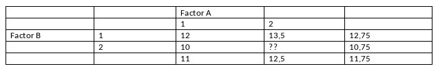

```{r, echo = FALSE, results = "hide"}
include_supplement("vufgb-expectedvalue-001-en-table01.jpg", recursive = TRUE)
```

Question
========

Given is the 2x2 table below with sample averages for Factors A and B, with 5 subjects in each cell. What mean would you expect in the cell with the missing value if there is no interaction effect?


  
Answerlist
----------
* 11.50
* 11.75
* 12.00
* 12.50


Solution
========

Answerlist
----------
* Correct
* Incorrect
* Incorrect
* Incorrect

Meta-information
================
exname: vufgb-expectedvalue-001-en
extype: schoice
exsolution: 1000
exsection: Probability/Elementary Probability/Random variables/Expected value
exextra[Type]: Interpreting output, Calculation
exextra[Program]: 
exextra[Language]: English
exextra[Level]: Statistical Thinking
