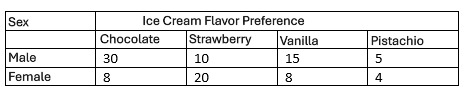

```{r, echo = FALSE, results = "hide"}
include_supplement("vufgb-expectedvalue-002-en-table01.JPG", recursive = TRUE)
```

Question
========

Given are the following frequencies for the two nominal variables Gender and Ice Cream Flavor Preference from 100 subjects. What is the expected frequency for the cell Male, Strawberry under validity of $H_{0}$: No relationship between Gender and Preferred Ice Cream Flavors?


  
Answerlist
----------
* 10
* 12
* 12.5
* 15


Solution
========

Answerlist
----------
* Incorrect
* Correct
* Incorrect
* Incorrect

Meta-information
================
exname: vufgb-expectedvalue-002-en
extype: schoice
exsolution: 0100
exsection: Probability/Elementary Probability/Random variables/Expected value, Descriptive statistics/Data representation/Tables/Frequency table
exextra[Type]: Interpreting output
exextra[Program]: 
exextra[Language]: English
exextra[Level]: Statistical Literacy
