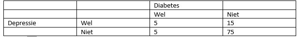

```{r, echo = FALSE, results = "hide"}
include_supplement("vufgb-expectedvalue-004-nl-table01.jpg", recursive = TRUE)
```

Question
========

Using the cross tabulation below with data from 100 elderly people, Marleen wants to investigate whether there is an association between Depression and Diabetes. What is the expected frequency $f_{e}$ in the cell Well Depression and Well Diabetes under the null hypothesis of independence?


  
Answerlist
----------
* 5
* 15
* 1.6
* 2

Solution
========

Answerlist
----------
* Incorrect
* Incorrect
* Incorrect
* Correct

Meta-information
================
exname: vufgb-expectedvalue-004-en
extype: schoice
exsolution: 0001
exsection: Probability/Elementary Probability/Random variables/Expected value
exextra[Type]: Interpreting output, Calculation
exextra[Program]: 
exextra[Language]: English
exextra[Level]: Statistical Literacy
