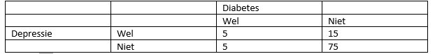

```{r, echo = FALSE, results = "hide"}
include_supplement("vufgb-expectedvalue-004-nl-table01.jpg", recursive = TRUE)
```

Question
========

Marleen wil aan hand van onderstaande kruistabel met gegevens van 100 ouderen onderzoeken of er een verband is tussen Depressie en Diabetes. Wat is de verwachte frequentie $f_{e}$ in de cel Wel Depressie en Wel Diabetes onder de nulhypothese van onafhankelijkheid?


  
Answerlist
----------
* 5
* 15
* 1.6
* 2

Solution
========

Answerlist
----------
* Incorrect
* Incorrect
* Incorrect
* Correct

Meta-information
================
exname: vufgb-expectedvalue-004-nl
extype: schoice
exsolution: 0001
exsection: Probability/Elementary Probability/Random variables/Expected value
exextra[ID]: 5e812
exextra[Type]: Interpreting output, Calculation
exextra[Program]: 
exextra[Language]: Dutch
exextra[Level]: Statistical Literacy
