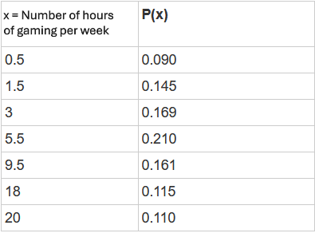

```{r, echo = FALSE, results = "hide"}
include_supplement("vufsw-expectedvalue-0118-en.PNG", recursive = TRUE)
```

Question
========
When examining how often gamers between the ages of 18-25 play video games play, one researcher finds the results in the table below.  
  
What is the **expected value** (*expected value*) of the number of hours that gamers aged 18-25 years play video games per week based on this sample? Round to one decimal place.  
  


Answerlist
----------
* 7.7 hours
* 5.5 hours
* Between 3.0 and 5.5 hours
* Between 9.5 and 18.0 hours

Solution
========

Answerlist
----------
* True
* False
* False
* False

Meta-information
================
exname: vufsw-expectedvalue-0118-en
extype: schoice
exsolution: 1000
exshuffle: TRUE
exsection: probability/elementary probability/random variables/expected value
exextra[ID]: 9732a
exextra[Type]: calculation
exextra[Program]: calculator
exextra[Language]: English
exextra[Level]: statistical thinking

