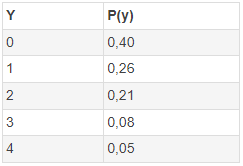

```{r, echo = FALSE, results = "hide"}
include_supplement("vufsw-expectedvalue-1098-nl.png", recursive = TRUE)
```

Question
========
Hieronder vind je een kansverdeling.  
  

  
Wat is de verwachte waarde **E(y)** van deze verdeling?

Answerlist
----------
* 0.60
* 1.12
* 2.20
* 0.40
* 2.00
* 0.25

Solution
========

(1)(0.26) + (2)(0.21) + (3)(0.08) + (4)(0.05) = 0 + 0.26 + 0.42 + 0.24 + 0.2 = **1.12**

Answerlist
----------
* Onjuist
* Waar
* Onwaar
* Onwaar
* Onwaar
* Onwaar

Meta-information
================
exname: vufsw-expectedvalue-1098-nl
extype: schoice
exsolution: 010000
exshuffle: TRUE
exsection: probability/elementary probability/random variables/expected value
exextra[Type]: performing analysis
exextra[Program]: calculator
exextra[Language]: Dutch
exextra[Level]: statistical literacy

