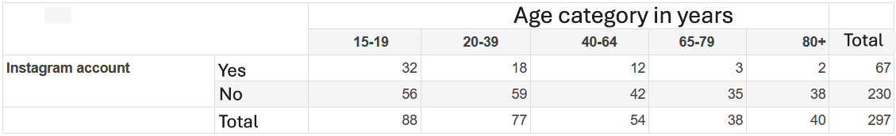

```{r, echo = FALSE, results = "hide"}
include_supplement("vufsw-probability-0050-en.PNG", recursive = TRUE)
```

Question
========
A student at the VU has conducted research on the use of social media among Dutch people. For her thesis, she collected data on the use of Instagram of 297 people. In the following table, the age range of the respondents is plotted according to the question of whether they have an Instagram account (actual observed numbers).  
What is the conditional probability that someone has an Instagram account, given that he/she belongs to the middle age group (40-64 years), based on the data in this table? (In percent; round to two decimal places)   
  


Answerlist
----------
* 22,22%
* 6,06%
* 26,87%
* 15,09%
* 30,20%
* 10,14%

Solution
========

Answerlist
----------
* True
* False
* False
* False
* False
* False

Meta-information
================
exname: vufsw-probability-0050-en
extype: schoice
exsolution: 100000
exshuffle: TRUE
exsection: probability
exextra[ID]: 26cb3
exextra[Type]: calculation
exextra[Program]: calculator
exextra[Language]: English
exextra[Level]: statistical literacy

