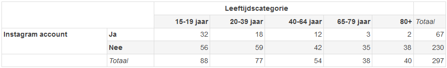

```{r, echo = FALSE, results = "hide"}
include_supplement("vufsw-probability-0050-nl.png", recursive = TRUE)
```

Question
========
Een student aan de VU heeft onderzoek gedaan naar het gebruik van
sociale media onder Nederlanders. Voor haar thesis verzamelde zij
gegevens over het gebruik van Instagram van 297 mensen. In de volgende
tabel wordt de leeftijdscategorie van de respondenten uitgezet naar de
vraag of ze een Instagram account hebben (feitelijk geobserveerde
aantallen).  
Wat is de conditionele kans dat iemand een Instagram account heeft,
gegeven dat hij/zij tot de middelste leeftijdscategorie behoort (40–64
jaar), op basis van de gegevens in deze tabel? (In procenten; rond af op
twee decimalen)   
  


Answerlist
----------
* 22,22%
* 6,06%
* 26,87%
* 15,09%
* 30,20%
* 10,14%

Solution
========


Answerlist
----------
* True
* False
* False
* False
* False
* False

Meta-information
================
exname: vufsw-probability-0050-nl
extype: schoice
exsolution: 100000
exshuffle: TRUE
exsection: probability
exextra[Type]: calculation
exextra[Program]: calculator
exextra[Language]: Dutch
exextra[Level]: statistical literacy

