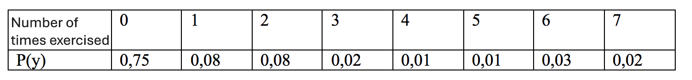

```{r, echo = FALSE, results = "hide"}
include_supplement("vufsw-probability-0052-en.PNG", recursive = TRUE)
```

Question
========
A researcher is curious about how often people exercise per week and interviews 100 people. He finds the following results.  
What is the expectation value E(Y) of the number of times exercising per week based on this sample? Round the answer to 2 decimal places.   
  


Answerlist
----------
* 0,71
* 0,74
* 0,13
* 0,04
* 0,06

Solution
========

Language Dutch

M&T Basics of quantitative research Basics of quantitative research

M&T BIS Default value
Answerlist
----------
* True
* False
* False
* False
* False

Meta-information
================
exname: vufsw-probability-0052-en
extype: schoice
exsolution: 10000
exshuffle: TRUE
exsection: probability
exextra[Type]: calculation
exextra[Program]: calculator
exextra[Language]: English
exextra[Level]: statistical literacy

