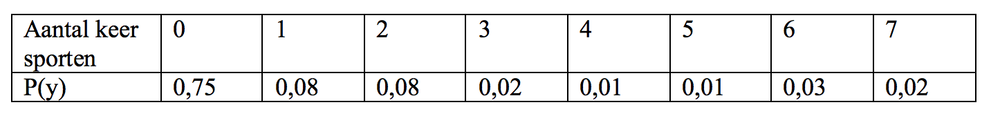

```{r, echo = FALSE, results = "hide"}
include_supplement("vufsw-probability-0052-nl.png", recursive = TRUE)
```

Question
========
Een onderzoeker is benieuwd hoe vaak mensen per week sporten en
ondervraagt 100 mensen. Hij vindt de volgende resultaten.  
Wat is de verwachtingswaarde E(Y) van het aantal keren sporten per week
op basis van deze steekproef? Rond het antwoord af op 2 decimalen.   
  


Answerlist
----------
* 0,71
* 0,74
* 0,13
* 0,04
* 0,06

Solution
========


Language  
Nederlands

M&T Basics of quantitative research  
Basics of quantitative research

M&T BIS  
Default value
Answerlist
----------
* True
* False
* False
* False
* False

Meta-information
================
exname: vufsw-probability-0052-nl
extype: schoice
exsolution: 10000
exshuffle: TRUE
exsection: probability
exextra[ID]: 24a1c
exextra[Type]: calculation
exextra[Program]: calculator
exextra[Language]: Dutch
exextra[Level]: statistical literacy

