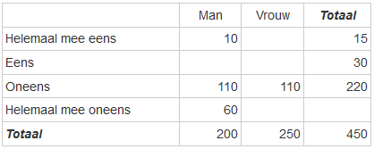

```{r, echo = FALSE, results = "hide"}
include_supplement("1641291646198.png", recursive = TRUE)
```

Question
========
A survey asked students whether they agreed with the statement that classes should remain online as much as possible after Corona. The table below - fictitious and incomplete - shows the responses, broken down by male and female students.  
  
What percentage of female students **wholly disagree** with the statement?  
  


Answerlist
----------
* 50%
* 30%
* 28%
* 25%

Solution
========

Answerlist
----------
* True
* False
* False
* False

Meta-information
================
exname: vufsw-probability-2004-en
extype: schoice
exsolution: 1000
exshuffle: TRUE
exsection: probability
exextra[Type]: calculation
exextra[Program]: calculator
exextra[Language]: English
exextra[Level]: statistical literacy

