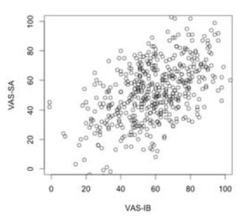
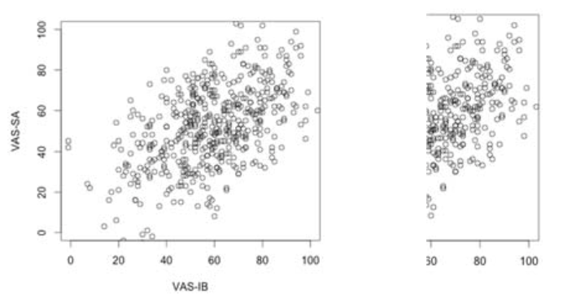

```{r, echo = FALSE, results = "hide"}
#Load package
library(exams)
library(knitr)

# add picture
include_supplement("eur-reliability-120-en-img120.png", recursive = TRUE)
include_supplement("eur-reliability-120-en-img1201.png", recursive = TRUE)
```
Question
========
In een klinische studie onderzoekt een onderzoeker de relatie tussen visuele analoge schalen (VAS) en interpretatiebias (VAS-IB) bij kinderen bij wie een angststoornis is vastgesteld. Hieronder zie je de scatterplot van de twee variabelen in de niet-klinische populatie. De correlatie tussen de variabelen is .5.



Leg uit of de correlatie tussen VAS-IB en VAS-SA in een klinische populatie, waarbij de VAS-IB scores ruwweg in het bereik [60,100] zullen liggen, ongeveer hetzelfde, lager of hoger zal zijn dan de correlatie in de niet-klinische populatie.

Solution
========
De correlatie tussen VAS-IB en VAS-SA in een klinische populatie zal lager zijn dan de correlatie in de niet-klinische situatie. Dit komt omdat er een beperking is van het bereik in ten minste één van de variabelen (VAS-SA). Omdat de variatie in scores lager is, zal de correlatie tussen elke andere variabele kleiner zijn. Zie de onderstaande figuur. Voor het hele bereik (links) is de correlatie veel hoger dan voor het beperkte bereik [60-100].



Meta-information
================
exname: eur-reliability-120-nl
extype: string
exsolution: ""
extol: 
exsection: Reliability/Analysis/Cronbach's alpha
exextra[Type]: Conceptual
exextra[Program]: 
exextra[Language]: Dutch
exextra[Level]: Statistical Literacy
