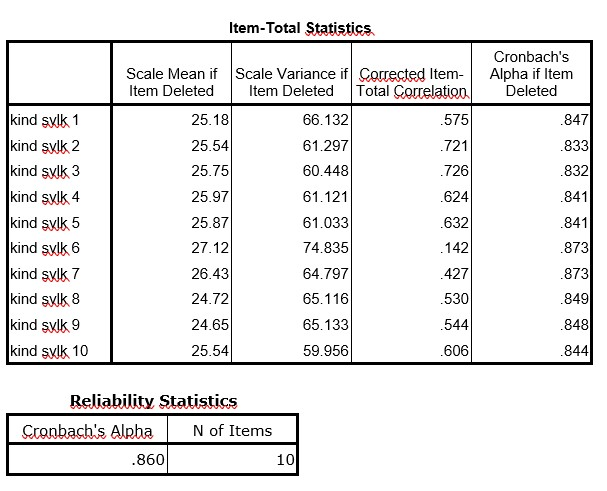

```{r, echo = FALSE, results = "hide"}
include_supplement("uu-Analysis-001-nl-tabel.jpg", recursive = TRUE)
```

Question
========
  
For a project, two interns are researching the re-experiences of children who have experienced a car accident. Below is the output of the reliability analysis.



Which item(s) would you like to remove in the next step of this analysis? And why? 
Answerlist
----------
* Item 10 because the dispersion (variance) becomes smallest if you remove this item.
* Items 6 and 7 because the item-rest correlations are too small.
* Items 6 and 7 because Cronbach's alpha increases when you remove these items.
* Item 6 because Cronbach's alpha increases if you remove this item and because this item-rest correlation is smallest. 

Solution
========

Meta-information
================
exname: uu-Analysis-001-en
extype: schoice
exsolution: 0001
exsection: Reliability/Analysis
exextra[Type]: Interpreting output
exextra[Program]: SPSS
exextra[Language]: English
exextra[Level]: Statistical Literacy
