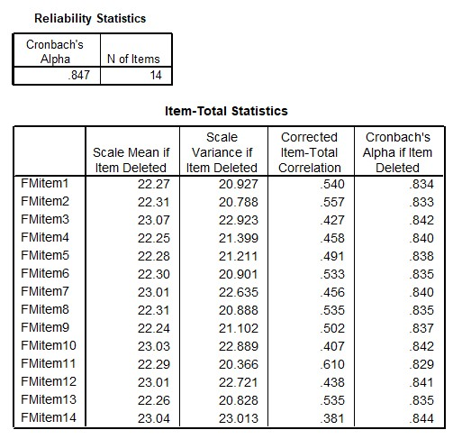

```{r, echo = FALSE, results = "hide"}
include_supplement("uu-Cronbachs-alpha-001-nl-tabel.jpg", recursive = TRUE)
```

Question
========
The SPSS output below of the reliability analysis for the Negative Fear of Failure scale is based on data from the Performance Motivation Test for Children (PMTK). Suppose you need to shorten the test, which of the four items listed is least likely to be removed from the scale? 
  


  
Answerlist
----------
* Item 1
* Item 5
* Item 11
* Item 14

Solution
========
  
This question can be approached in 2 ways, item-rest correlation and Cronbach's Alpha if item deleted.
- Item-rest correlation: the higher the Item-rest correlation is (column: Corrected Item-Total Correlation), the better an item fits the scale. Thus, an item is least eligible when the Item-rest correlation is highest (indicating item 11, r = .61).
- Cronbach's Alpha if item deleted: The column of the same name gives the Cronbach's Alpha if the item in question is removed from the scale. Since the goal is to have the highest possible Cronbach's Alpha, an item is least likely to be removed if Cronbach's alpha is lowest (indicating item 11, alpha = .829).

Meta-information
================
exname: uu-Cronbach's-alpha-001-en
extype: schoice
exsolution: 0010
exsection: Reliability/Analysis/Cronbach's alpha
exextra[Type]: Interpreting output
exextra[Program]: SPSS
exextra[Language]: English
exextra[Level]: Statistical Literacy
