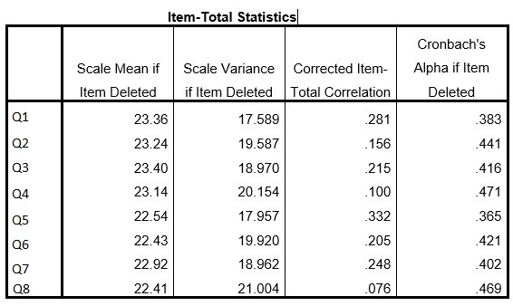

```{r, echo = FALSE, results = "hide"}
include_supplement("uu-Cronbach's-alpha-002-en-tabel.jpg", recursive = TRUE)
```

Question
========
  
Prof. A. James is analyzing a survey. One of the scales has 8 questions. When she performs a reliability analysis she finds a Cronbach's alpha of 0.455. Below is part of the SPSS output. 


  
Suppose Prof. A. James has to shorten the test, which of the four items listed is last eligible to be removed from the scale?

Answerlist
----------
* Question (vr)1
* Question (vr)3
* Question (vr)5
* Question (vr)7

Solution
========
  


Answerlist
----------
* Removing which item would decrease Cronbach's Alpha the most?
* By removing which item, Cronbach's Alpha would decrease the most?
* By removing item 5, Cronbach's Alpha would decrease the most.
* By removing which item, Cronbach's Alpha would decrease the most?

Meta-information
================
exname: uu-Cronbach's-alpha-002-en
extype: schoice
exsolution: 0010
exsection: Reliability/Analysis/Cronbach's alpha
exextra[Type]: Interpretating output
exextra[Program]: SPSS
exextra[Language]: English
exextra[Level]: Statistical Literacy
