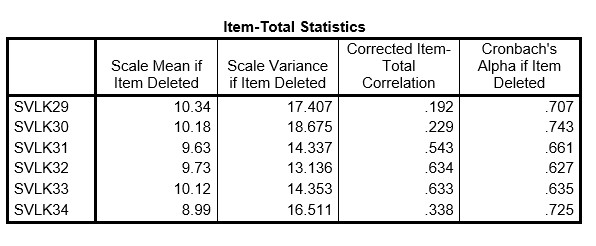

```{r, echo = FALSE, results = "hide"}
include_supplement("uu-Cronbachs-alpha-004-en-tabel.jpg", recursive = TRUE)
```


Question
========
  
A group of researchers wants to develop an instrument to measure how traumatized children are after experiencing a car accident. Based on existing trauma literature, they have created items that belong to one of the following scales: re-experiencing, avoidance, irritability, and sleep problems. Since the children themselves are too traumatized, they administer their 36 items to 314 parents. Because the researchers expect four subscales, they conduct a factor analysis with 4 factors. Part of the SPSS output is shown below.

One of the researchers, Rolf, is specifically interested in the sleep problems observed by parents in these children. For this reason, he creates a sleep problems scale consisting of 6 items. When Rolf conducts a reliability analysis, he finds a Cronbach’s alpha of 0.725. Below is part of the SPSS output.



Based on "Cronbach’s Alpha if Item Deleted," which item is the first candidate for removal from the scale?

Answerlist
----------
* Item 34
* Item 32
* Item 30
* Item 29


Solution
========
  
Item 30

Meta-information
================
exname: uu-Cronbach's-alpha-004-en
extype: schoice
exsolution: 0010
exsection: Reliability/Analysis/Cronbach's alpha
exextra[ID]: 958dd
exextra[Type]: Interpreting output
exextra[Program]: SPSS
exextra[Language]: English
exextra[Level]: Statistical Literacy
