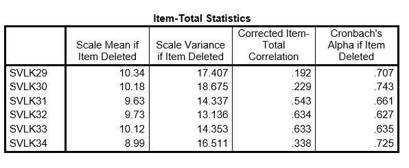

```{r, echo = FALSE, results = "hide"}
include_supplement("uu-Cronbachs-alpha-004-nl-tabel.jpg", recursive = TRUE)
```


Question
========
  
A group of researchers want to develop an instrument that measures how traumatized children are after experiencing a car accident. Based on existing trauma literature, they created items belonging to one of the following scales: re-experiencing, avoidance, arousal, and sleep problems. Because the children themselves are too traumatized, they are taking their 36 items from 314 parents.  Because the researchers expect four subscales, they conduct a factor analysis with 4 factors. Part of the SPSS output is below.

One of the researchers, Rolf, is specifically interested in the sleep problems parents observe in these children. For this reason, he creates a scale for sleep problems consisting of 6 items. When Rolf performs a reliability analysis, he finds a Cronbach's alpha of 0.725. Below is part of the SPSS output. 



Based on "Cronbach's Alpha if item Deleted," which item comes first for removal from the scale?

Answerlist
----------
* Item 34
* Item 32
* Item 30
* Item 29


Solution
========
  
Item 30

Meta-information
================
exname: uu-Cronbach's-alpha-004-nl.-en
extype: schoice
exsolution: 0010
exsection: Reliability/Analysis/Cronbach's alpha
exextra[Type]: Interpreting output
exextra[Program]: SPSS
exextra[Language]: English
exextra[Level]: Statistical Literacy

