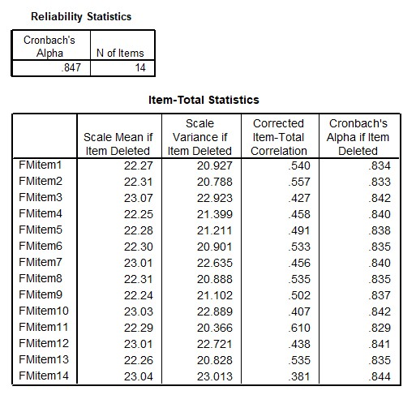

```{r, echo = FALSE, results = "hide"}
include_supplement("uu-Cronbach's-alpha-008-en-tabel.jpg", recursive = TRUE)
```


Question
========
The SPSS output below presents the reliability analysis for the Negative Fear of Failure scale, based on data from the Performance Motivation Test for Children (PMTK).


  
Suppose you need to shorten the test. Which of the four listed items is the first candidate for removal from the scale?
  
Answerlist
----------
* Item 14
* Item 11
* Item 2
* None of these items

Solution
========
  

Answerlist
----------
* Removing item 14 would lower Cronbach's Alpha. Is that what you want?
* Removing item 11 would lower Cronbach's Alpha. Is that what you want?
* Removing item 2 would lower Cronbach's Alpha. Is that what you want?
* Correct

Meta-information
================
exname: uu-Cronbach's-alpha-008-en
extype: schoice
exsolution: 0001
exsection: Reliability/Analysis/Cronbach's alpha
exextra[Type]: Interpretating output
exextra[Program]: SPSS
exextra[Language]: English
exextra[Level]: Statistical Literacy
