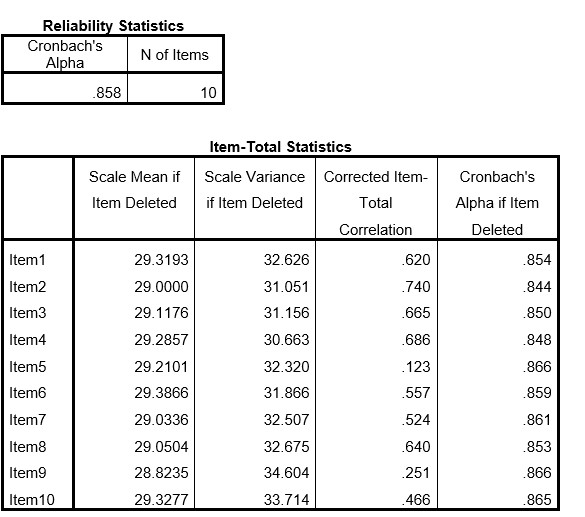

```{r, echo = FALSE, results = "hide"}
include_supplement("uu-Cronbach's-alpha-010-en-tabel.jpg", recursive = TRUE)
```

Question
========
  
Daan administered a 10-question questionnaire to a sample of 100 people. He thinks he is measuring the construct "loneliness." He is conducting a reliability analysis. Part of the SPSS output is below.


Which item comes first for removal?


Answerlist
----------
* Item 5
* Item 6
* Item 9
* Item 5 and 9

Solution
========
  

Answerlist
----------
* Good
* At which item is the item-total correlation lowest?
* Which item has the lowest item-total correlation?
* At which item is the item-total correlation lowest?

Meta-information
================
exname: uu-Cronbach's-alpha-010-en
extype: schoice
exsolution: 1000
exsection: Reliability/Analysis/Cronbach's alpha
exextra[ID]: 1804c
exextra[Type]: Interpretating output
exextra[Program]: SPSS
exextra[Language]: English
exextra[Level]: Statistical Literacy
