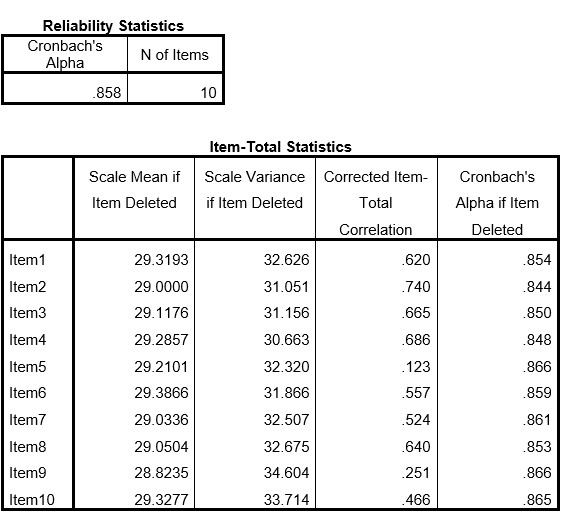

```{r, echo = FALSE, results = "hide"}
include_supplement("uu-Cronbachs-alpha-010-nl-tabel.jpg", recursive = TRUE)
```


Question
========
  
Daan heeft een vragenlijst van tien vragen aan een steekproef van 100 mensen gegeven. Hij denkt het construct “eenzaamheid” te meten. Hij voert een betrouwbaarheidsanalyse uit. Deel van de SPSS output staat hieronder.


  
Answerlist
----------
* Item 5
* Item 6
* Item 9
* Item 5 en 9

Solution
========
  


Answerlist
----------


Meta-information
================
exname: uu-Cronbach's-alpha-010-nl.Rmd
extype: schoice
exsolution: 1000
exsection: Reliability/Analysis/Cronbach's alpha
exextra[Type]: Interpreting output
exextra[Program]: SPSS
exextra[Language]: Dutch
exextra[Level]: Statistical Literacy
