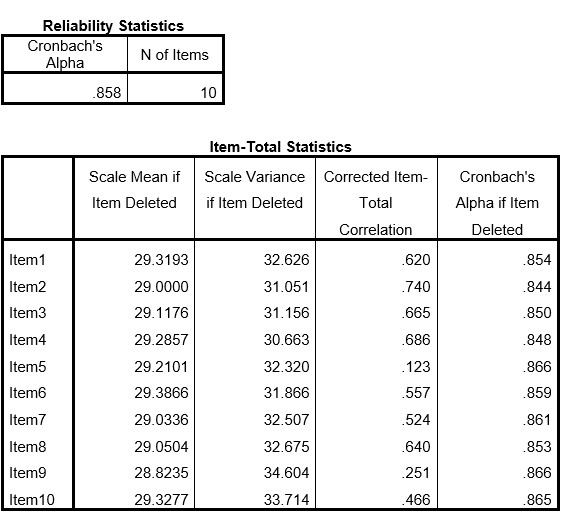

```{r, echo = FALSE, results = "hide"}
include_supplement("uu-Cronbach's-alpha-010-nl-tabel.jpg", recursive = TRUE)
```


Question
========
  
Daan heeft een vragenlijst van tien vragen aan een steekproef van 100 mensen gegeven. Hij denkt het construct “eenzaamheid” te meten. Hij voert een betrouwbaarheidsanalyse uit. Deel van de SPSS output staat hieronder.


Welk item komt als eerste in aanmerking voor verwijdering?


Answerlist
----------
* Item 5
* Item 6
* Item 9
* Item 5 en 9

Solution
========
  

Answerlist
----------
* Goed
* Bij welk item is de item-total correlation het laagst?
* Bij welk item is de item-total correlation het laagst?
* Bij welk item is de item-total correlation het laagst?


Meta-information
================
exname: uu-Cronbach's-alpha-010-nl
extype: schoice
exsolution: 1000
exsection: Reliability/Analysis/Cronbach's alpha
exextra[ID]: c9537
exextra[Type]: Interpretating output
exextra[Program]: SPSS
exextra[Language]: Dutch
exextra[Level]: Statistical Literacy
