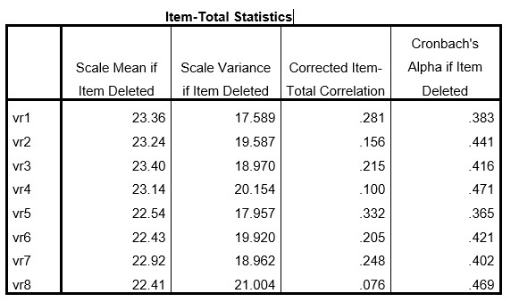

```{r, echo = FALSE, results = "hide"}
include_supplement("uu-Cronbach's-alpha-012-nl-tabel.jpg", recursive = TRUE)
```

Question
========
  
Prof. A. James is analyzing a survey. One of the scales has 8 questions. When she performs a reliability analysis she finds a Cronbach's alpha of $0.455$. Below is part of the SPSS output. 


  
Which item should Prof. A. James remove first?

Answerlist
----------
* Question 4
* Question 5
* Question 8
* Question 1

Solution
========

Meta-information
================
exname: uu-Cronbach's-alpha-012-en
extype: schoice
exsolution: 1000
exsection: Reliability/Analysis/Cronbach's alpha
exextra[Type]: Interpretating output
exextra[Program]: SPSS
exextra[Language]: English
exextra[Level]: Statistical Literacy
