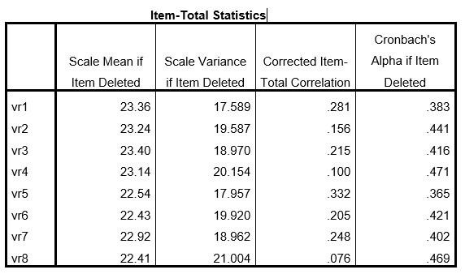

```{r, echo = FALSE, results = "hide"}
include_supplement("uu-Cronbach's-alpha-012-nl-tabel.jpg", recursive = TRUE)
```


Question
========
  
Prof. A. James is bezig met het analyseren van een enquête. Een van de schalen heeft 8 vragen. Als zij een betrouwbaarheidsanalyse uitvoert vindt zij een Cronbach’s alpha van $0.455$. Hieronder staat deel van de SPSS output. 


  
Welk item zou Prof. A. James als eerste moeten verwijderen?

Answerlist
----------
* Vraag 4
* Vraag 5
* Vraag 8
* Vraag 1

Solution
========
  


Answerlist
----------


Meta-information
================
exname: uu-Cronbach's-alpha-012-nl
extype: schoice
exsolution: 1000
exsection: Reliability/Analysis/Cronbach's alpha
exextra[Type]: Interpretating output
exextra[Program]: SPSS
exextra[Language]: Dutch
exextra[Level]: Statistical Literacy
