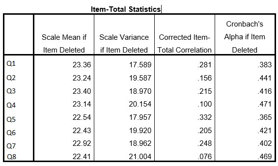

```{r, echo = FALSE, results = "hide"}
include_supplement("uu-Cronbach's-alpha-013-en-tabel.jpg", recursive = TRUE)
```

Question
========
  
Prof. A. James is analyzing a survey. One of the scales has 8 questions. When she performs a reliability analysis she finds a Cronbach's alpha of $0.455$. Below is part of the SPSS output. 



Based on these data, Prof. A. James decides not to remove items from this scale. She gives two arguments for this:

I. Removing items creates the danger of affecting internal validity. 
II. Because the scale consists of only 8 items, the scale with all 8 items will be more reliable on average than a scale with only 7 or even only 6 items.


  
Answerlist
----------
* Both statements are correct
* Only statement I is correct
* Only statement II is correct
* Neither statement is correct

Solution
========

Meta-information
================
exname: uu-Cronbach's-alpha-013-en
extype: schoice
exsolution: 0010
exsection: Reliability/Analysis/Cronbach's alpha
exextra[ID]: a6285
exextra[Type]: Interpretating output
exextra[Program]: SPSS
exextra[Language]: English
exextra[Level]: Statistical Literacy
