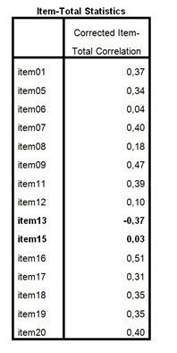

```{r, echo = FALSE, results = "hide"}
include_supplement("uu-Cronbach's-alpha-016-nl-tabel.jpg", recursive = TRUE)
```

Question
========
  
In the Painters Career Project, for a (pilot) study of the mobility desires of painters, 20 items were administered to a random sample from the target population ($n = 86$). The table below shows the item-rest correlations ($r_{ir}$) of the 20 items.



Evaluate the following two statements:

I. By reversing ITEM13, Cronbach's alpha will almost certainly be lower. II. By removing ITEM15, Cronbach's alpha will almost certainly be lower.


Answerlist
----------
* Utterance I and II are both correct.
* Only pronunciation I is correct.
* Only pronunciation II is correct.
* Pronunciation I and II are both incorrect.


Solution
========


Theorem I: Item13 shows a fairly high negative item residual correlation. If this item were to be pooled, this would result in the item residual correlation becoming positive. This benefits the reliability (Cronbach's alpha) of the scale, after all, the items must be equally pooled to measure the Cronbach's alpha. Thus, the Cronbach's alpha will increase.

Theorem II: Item15 shows a very low item residual correlation, the lowest of all the items. Removing this item will remove an item that has very low correlation with the remaining items. The internal consistency of the scale will increase when Item15 is removed, so Cronbach's alpha will likely actually increase.

Meta-information
================
exname: uu-Cronbach's-alpha-016-en
extype: schoice
exsolution: 0001
exsection: Reliability/Analysis/Cronbach's alpha
exextra[Type]: Interpretating output
exextra[Program]: SPSS
exextra[Language]: English
exextra[Level]: Statistical Literacy
