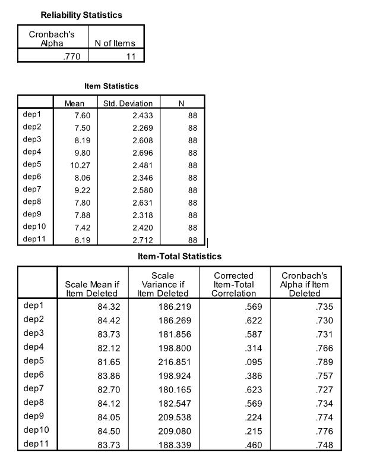

```{r, echo = FALSE, results = "hide"}
include_supplement("uu-Cronbachs-alpha-017-en-tabel.JPG", recursive = TRUE)
```

Question
========
  
Onderzoekers zijn geïnteresseerd in de relatie tussen depressie en persoonlijkheidsstoornissen. Persoonlijkheidsstoornissen zijn problematische eigenschappen en gedragingen die het gebruikelijke bereik van individuele verschillen overschrijden. De onderzoekers hielden interviews waarin persoonlijkheidsstoornissen werden beoordeeld bij adolescenten die opgenomen waren in een psychiatrische instelling. Depressie werd gemeten met een vragenlijst bestaande uit 11 vragen.


Om de interne consistentie van de depressievragenlijst te meten, werd Cronbach's Alpha berekend. 



Wat is de invloed van item dep5 op Cronbach's Alpha? 
Answerlist
----------
* Het heeft een positieve invloed op alfa; dit wordt veroorzaakt door het hoge gemiddelde van het item.
* Het heeft een negatieve invloed op alfa; dit wordt veroorzaakt door de schaalgemiddelde van het item als het item wordt verwijderd.
* Het heeft een positieve invloed op alfa; dit wordt veroorzaakt door de Cronbach's alpha van het item indien item verwijderd.
* Het heeft een negatieve invloed op alpha; dit wordt veroorzaakt door de gecorrigeerde item-totaal correlatie van het item.


Solution
========
  
Answerlist
----------
* Dit antwoord is onjuist.
* Dit antwoord is onjuist.
* Dit antwoord is onjuist.
* Dit antwoord is juist.

Meta-information
================
exname: uu-Cronbach's-alpha-017-nl
extype: schoice
exsolution: 0001
exsection: Reliability/Analysis/Cronbach's alpha
exextra[Type]: Calculation, Case, Interpreting output
exextra[Program]: SPSS
exextra[Language]: Dutch
exextra[Level]: Statistical Literacy
