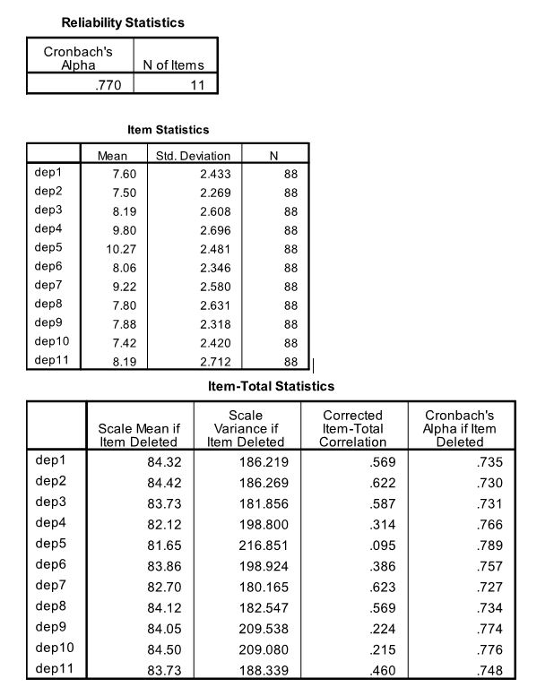

```{r, echo = FALSE, results = "hide"}
include_supplement("uu-Cronbachs-alpha-017-nl-tabel.JPG", recursive = TRUE)
```

Question
========
  
Onderzoekers zijn geïnteresseerd in de relatie tussen depressie en persoonlijkheidsstoornissen. Persoonlijkheidsstoornissen zijn problematische kenmerken en gedragingen die buiten de gebruikelijke individuele verschillen vallen. De onderzoekers voerden interviews uit om persoonlijkheidsstoornissen te beoordelen bij adolescente psychiatrische patiënten. Depressie werd gemeten met een vragenlijst bestaande uit 11 vragen.

Om de interne consistentie van de depressievragenlijst te meten, werd Cronbach’s Alpha berekend.



Wat is de invloed van item dep5 op Cronbach’s Alpha?
  
Answerlist
----------
* Het heeft een positieve invloed op alpha; dit komt door de hoge gemiddelde score van het item.
* Het heeft een negatieve invloed op alpha; dit komt door de Scale Mean if item deleted van het item.
* Het heeft een positieve invloed op alpha; dit blijkt uit de Cronbach’s alpha if item deleted van het item.
* Het heeft een negatieve invloed op alpha; dit komt door de corrected item-total correlation van het item.

Solution
========
  
Answerlist
----------
* Dit antwoord is onjuist.
* Dit antwoord is onjuist.
* Dit antwoord is onjuist.
* Dit antwoord is juist.


Meta-information
================
exname: uu-Cronbach's-alpha-017-nl
extype: schoice
exsolution: 0001
exsection: Reliability/Analysis/Cronbach's alpha
exextra[Type]: Calculation, Case, Interpreting output
exextra[Program]: SPSS
exextra[Language]: Dutch
exextra[Level]: Statistical Literacy
