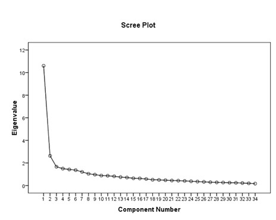
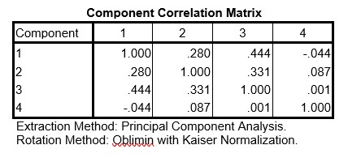

```{r, echo = FALSE, results = "hide"}
include_supplement("uu-Cronbachs-alpha-003-en-tabel.jpg", recursive = TRUE)
```

```{r, echo = FALSE, results = "hide"}
include_supplement("uu-Cronbachs-alpha-003-en-tabel2.jpg", recursive = TRUE)
```

```{r, echo = FALSE, results = "hide"}
include_supplement("uu-Cronbachs-alpha-003-en-tabel3.jpg", recursive = TRUE)
```

Question
========
  
A group of researchers wants to develop an instrument to measure how traumatized children are after experiencing a car accident. Based on existing trauma literature, they have created items that belong to one of the following scales: re-experiencing, avoidance, irritability, and sleep problems. Since the children themselves are too traumatized, they administer the 36 items to 314 parents. Since the researchers expect four subscales, they perform a factor analysis with 4 factors. Part of the SPSS output is shown below.




One of the researchers, Rolf, is specifically interested in the sleep problems that parents observe in these children. For this reason, he creates a scale for sleep problems consisting of 6 items. When Rolf performs a reliability analysis, he finds a Cronbach’s alpha of 0.725. Part of the SPSS output is shown below.


Based on this data, Rolf decides not to remove any items from this scale. He gives two arguments for this:

I. Removing items creates the risk of damaging content validity.
II. Since the scale consists of only 6 items, the scale with all 6 items will be more reliable than a scale with only 5 or even 4 items.

  
Answerlist
----------
* Only statement I is correct
* Only statement II is correct
* Both statements are correct
* Neither statement is correct

Solution
========
  
Both statements are correct.

Answerlist
----------
* Statement I is indeed correct. But statement II is also correct.
* Statement II is indeed correct. But statement I is also correct.
* Both statements are indeed correct.
* Both statements are correct.


Meta-information
================
exname: uu-Cronbachs-alpha-003-en
extype: schoice
exsolution: 0010
exsection: Reliability/Analysis/Cronbach's alpha
exextra[Type]: Interpreting output
exextra[Program]: SPSS
exextra[Language]: English
exextra[Level]: Statistical Literacy
