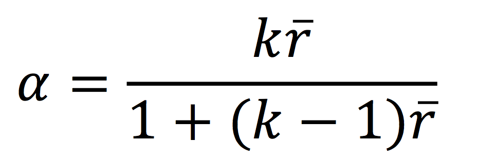

```{r, echo = FALSE, results = "hide"}
include_supplement("vufsw-cronbach's_alpha-1170-nl.png", recursive = TRUE)
```

Question
========
We onderzoeken enquêtegegevens van een steekproef van 239 respondenten. Gegeven is de volgende correlatiematrix (Pearson correlatiecoëfficiënt) van drie vragen van een schaal.  
  

<tabel> <colgroup> <col style="width: 25%" /> <col style="width: 25%" /> <col style="width: 25%" /> <col style="width: 25%" /> </colgroup> <tbody> <tr class="odd"> <td class="tvcss_2"><br /> </td> <td class="tvcss_3">Item1</td> <td class="tvcss_4">Item2</td> <td class="tvcss_4">Item3</td> </tr> <tr class="even"> <td class="tvcss_2">Item1<br /> </td> <td class="tvcss_3">1<br /> </td> <td class="tvcss_4"><br /> </td> <td class="tvcss_4"><br /> </td> </tr> <tr class="odd"> <td class="tvcss_2">Item2</td> <td class="tvcss_3">.312</td> <td class="tvcss_4">1</td> <td class="tvcss_4"><br /> </td> </tr> <tr class="even"> <td class="tvcss_2">Item3</td> <td class="tvcss_3">.357</td> <td class="tvcss_4">.451</td> <td class="tvcss_4">1</td> </tr> </tbody> </table>

  
Uit de gegevens blijkt verder dat de gemiddelde correlatie tussen de drie items 0,373 is. Neem aan dat de varianties van de drie items gelijk zijn. Hoe hoog is Cronbachs alfa?

Answerlist
----------
* 0.877
* 0.728
* 0.641
* 0.942
* 0.801

Solution
========

Je kunt het berekenen met: (3\*0,373)/(1+(2\*0,373))=0,641 Cronbachs alfa kan worden geschreven als een functie van het aantal testonderdelen en de gemiddelde intercorrelatie tussen de onderdelen. items en de gemiddelde intercorrelatie tussen de items. Hieronder tonen we de formule voor de gestandaardiseerde Cronbachs alfa:  
  

  
Hier is **k** gelijk aan het aantal items, r-bar is de gemiddelde inter-item correlatie tussen de items.  
Uit deze formule blijkt dat als je het aantal items verhoogt, je Cronbach's alpha verhoogt.  Bovendien, als de gemiddelde inter-item correlatie laag is, zal alpha laag zijn.  Als de gemiddelde inter-item correlatie toeneemt, neemt Cronbachs alfa ook toe (waarbij het aantal items constant).

Answerlist
----------
* Onwaar
* Onwaar
* Waar
* Onwaar
* Onwaar

Meta-information
================
exname: vufsw-cronbach's alpha-1170-nl
extype: schoice
exsolution: 00100
exshuffle: TRUE
exsection: reliability/analysis/cronbach's alpha
exextra[Type]: performing analysis
exextra[Program]: calculator
exextra[Language]: Dutch
exextra[Level]: statistical thinking

