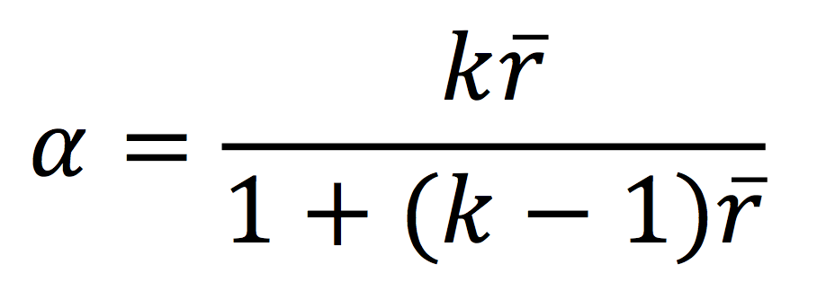

```{r, echo = FALSE, results = "hide"}
include_supplement("vufsw-cronbach's_alpha-1170-nl.png", recursive = TRUE)
```

Question
========
We onderzoeken enquêtegegevens van een steekproef van 239 respondenten. De volgende correlatiematrix (Pearson correlatiecoëfficiënt) van drie vragen van een schaal wordt weergegeven.
 

<table>
<colgroup>
<col style="width: 25%" />
<col style="width: 25%" />
<col style="width: 25%" />
<col style="width: 25%" />
</colgroup>
<tbody>
<tr class="odd">
<td class="tvcss_2"><br />
</td>
<td class="tvcss_3">Item1</td>
<td class="tvcss_4">Item2</td>
<td class="tvcss_4">Item3</td>
</tr>
<tr class="even">
<td class="tvcss_2">Item1<br />
</td>
<td class="tvcss_3">1<br />
</td>
<td class="tvcss_4"><br />
</td>
<td class="tvcss_4"><br />
</td>
</tr>
<tr class="odd">
<td class="tvcss_2">Item2</td>
<td class="tvcss_3">.312</td>
<td class="tvcss_4">1</td>
<td class="tvcss_4"><br />
</td>
</tr>
<tr class="even">
<td class="tvcss_2">Item3</td>
<td class="tvcss_3">.357</td>
<td class="tvcss_4">.451</td>
<td class="tvcss_4">1</td>
</tr>
</tbody>
</table>

  
De gegevens laten ook zien dat de gemiddelde correlatie tussen de drie items 0,373 is. Ga ervan uit dat de varianties van de drie items gelijk zijn. Hoe hoog is Cronbach's alpha?

Answerlist
----------
* 0.877
* 0.728
* 0.641
* 0.942
* 0.801

Solution
========


Je kunt het berekenen met: (3\*0,373)/(1+(2\*0,373))=0,641  
Cronbach's alpha kan worden uitgedrukt als een functie van het aantal 
testitems en de gemiddelde intercorrelatie tussen de items. Hieronder 
tonen we de formule voor de gestandaardiseerde Cronbach’s alpha:
  

  
Hier is **k** gelijk aan het aantal items, en r-bar is de gemiddelde 
inter-item correlatie tussen de items.
Uit deze formule blijkt dat als je het aantal items verhoogt, je 
Cronbach’s alpha verhoogt. Bovendien, als de gemiddelde inter-item 
correlatie laag is, zal alpha laag zijn. Naarmate de gemiddelde inter-item 
correlatie toeneemt, zal Cronbach’s alpha ook toenemen (terwijl het aantal 
items constant blijft).


Answerlist
----------
* False
* False
* True
* False
* False

Meta-information
================
exname: vufsw-cronbach's_alpha-1170-nl
extype: schoice
exsolution: 00100
exshuffle: TRUE
exsection: reliability/analysis/cronbach's alpha
exextra[Type]: performing analysis
exextra[Program]: calculator
exextra[Language]: Dutch
exextra[Level]: statistical thinking
